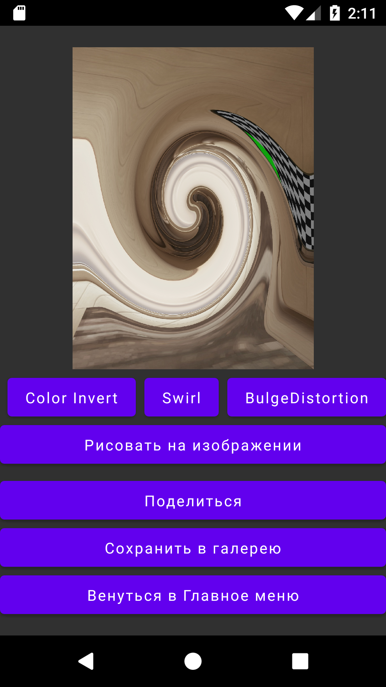

# Easy Photo Editor

Photo Editor is an Android application developed in Kotlin using Jetpack Compose. It allows users to apply filters, effects, and annotations to photos.

## Table of Contents

- [Features](#features)
- [Requirements](#requirements)
- [Libraries Used](#libraries-used)
- [Supported Android Versions](#supported-android-versions)
- [Usage](#usage)
- [Screenshots](#screenshots)
- [APK Download](#apk-download)
- [License](#license)

## Features

- Capture photos using the device's camera.
- Select photos from the device's gallery.
- Apply filters and effects to the selected photos.
- Draw and annotate on photos.
- Export edited photos to share on social media or save to the device.

## Requirements

- Android device with minimum SDK version 23.
- Kotlin programming language.
- Jetpack Compose library.

## Libraries Used

The following libraries were used in this project:

- [CameraX](https://developer.android.com/jetpack/androidx/releases/camera) - For camera functionality.
- [Glide](https://github.com/bumptech/glide) - For image loading and caching.
- [GPUImage](https://github.com/cats-oss/android-gpuimage) - For image processing and applying filters.

## Supported Android Versions

The app has been tested on the following Android versions:

- Android 12 (API level 31)
- Android 7.1 Nougat (API level 25)
- Android 7.0 Nougat (API level 24)
- Android 6.0 Marshmallow (API level 23)

Note: The app may work on other Android versions as well, but it has not been specifically tested on those versions.

## Usage

1. Launch the app on your Android device.

2. On the main menu screen, you will find two options: "Take a Photo" and "Select from Gallery".

3. Choose "Take a Photo" to capture a new photo using the device's camera.

4. Choose "Select from Gallery" to pick a photo from your device's gallery.

5. Once a photo is selected, you will be taken to the photo editing screen.

6. On the photo editing screen, you can apply filters, effects, and annotations to the photo.

7. After editing the photo, you can export it by sharing it on social media or saving it to your device.

## Screenshots

  
  
  
  
  

## APK Download

You can download the latest version of the app from the following link:

[Photo Editor APK](apk/EasyPhotoEditor.apk)

## License

This project is licensed under the [MIT License](LICENSE).
